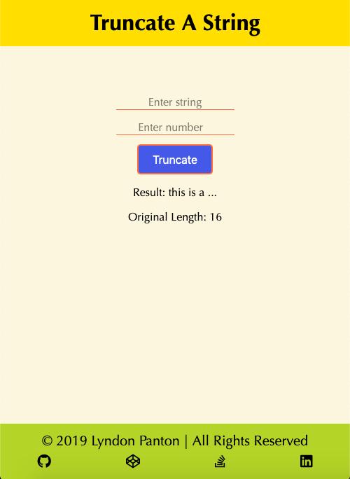
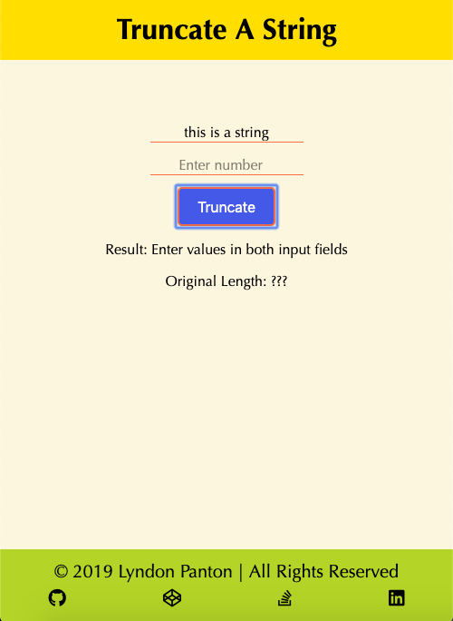
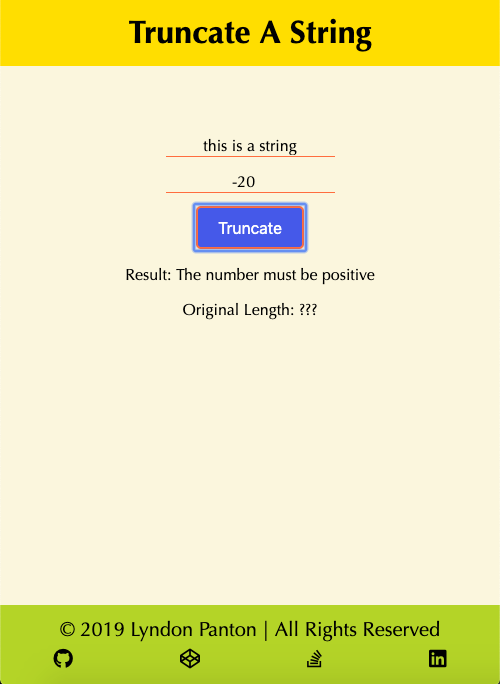
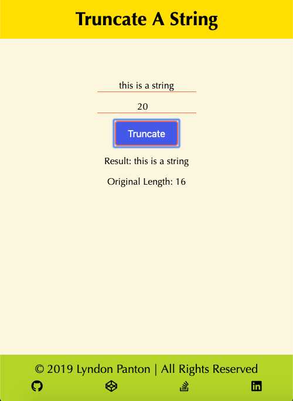
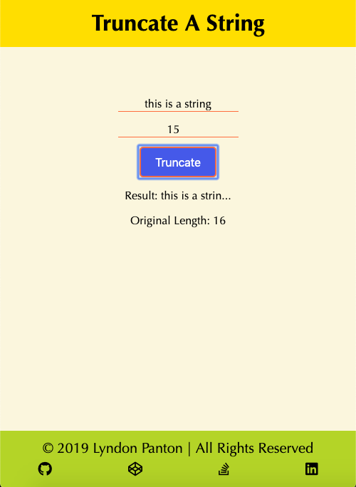
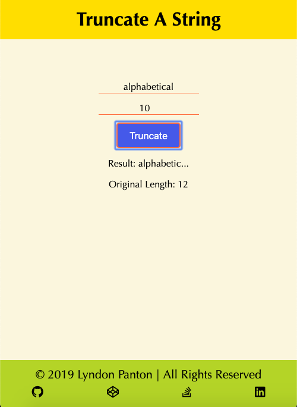
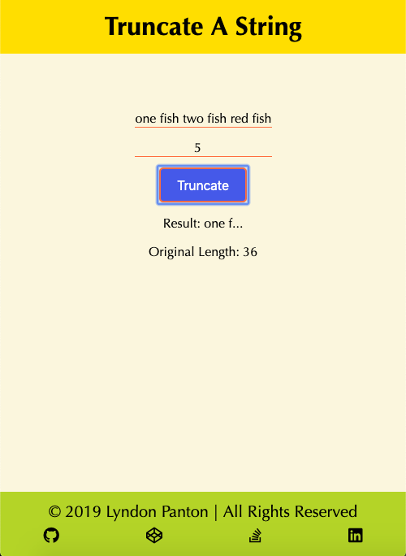

# Truncate A String

## How To Open
> 1. Go to the project's download folder
> 2. Right click on the file named _index.html_
> 3. Choose the _open with_ option
> 4. Open the application in your desired browser

## How To Use
> 1. Enter a string you want truncated in the first input field
> 2. Enter the amount of characters you want the string truncated by in the second field
> 3. Press the _Truncate_ button
> 4. The truncated string along with the value of its original length will be displayed below

## Requirements
> 1. This project requires a browser to run
> 2. The browser must have JavaScript available and enabled

## Extra Information
> 1. This was done for one of _freecodecamp_'s Basic Algorithm Scripting activities

## Preview

